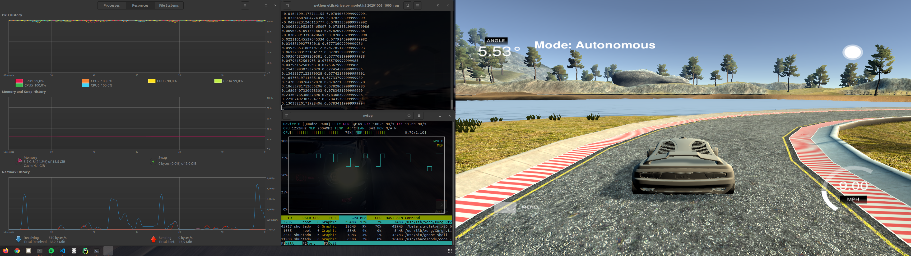
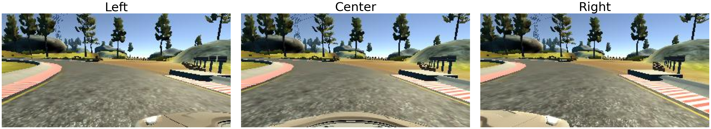
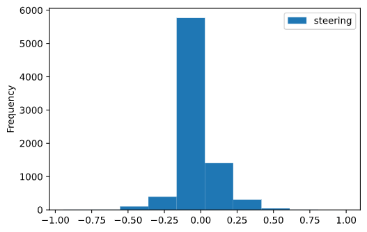
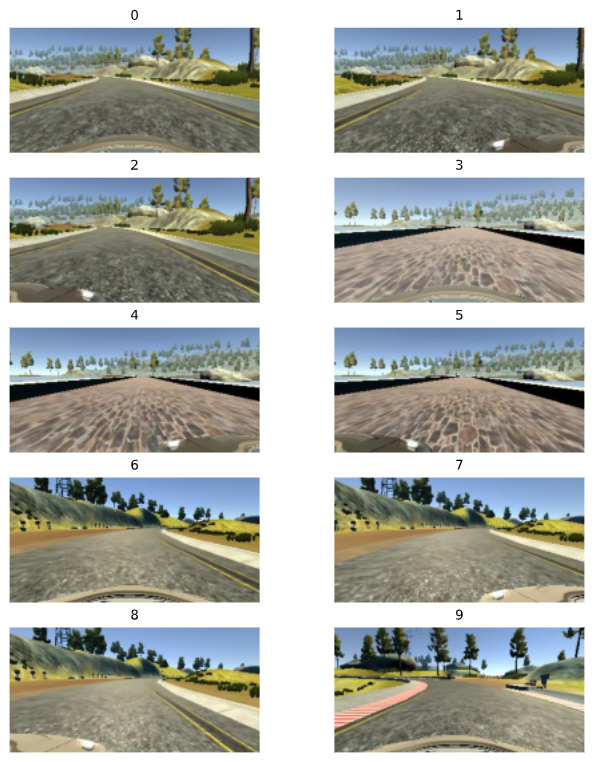
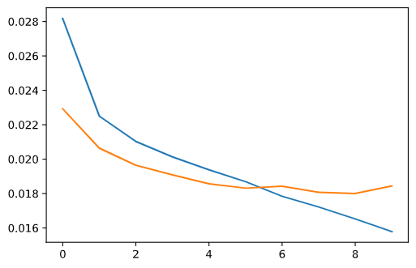

# **Behavioral Cloning** 

https://review.udacity.com/#!/rubrics/432/view

## Solution Design Approach

The process to train the model was:

- To load the data from the log, we have 8036 rows with 'center', 'left' and 'right' image paths, and  the floating value for the steering

- Shuffle and split the log file

- Load and preprocess each batch of data using a generator
- Load and preprocess each training batch using a generator for the validation set. The validation set does not flip the images.

### Training Set & Training Process
To train the network, we use three laps with the data provided with the project.

## Model Architecture and Training
http://alexlenail.me/NN-SVG/LeNet.html
### Model architecture development strategy
We develop three models for the network:
- A simple network to test out the different configurations of the Keras layers
- LeNet5 configuration to train and validate. We use it to learn how the different configurations can affect the results
- The [Nvidia model](https://developer.nvidia.com/blog/explaining-deep-learning-self-driving-car/) adding dropout layers to lower the overfitting
- Finally, we use the test data to validate the loss of the model
### Reducing overfitting in the model
To reduce the overfitting of the model we use the following strategies:
- Since the steering data has a bias towards the right we flip the images from right to left and get the inverse steering measure by multiply by -1

- We randomly set the gamma of the images 
- Use the left and right cameras and compute a +/- 0.25 correction for the steering to the right and left cameras, so for each frame we have three images and three different steering measures. This helps the network to know how to recover when driving to the sides
- Use dropout layers of 0.25 to the model, improving the loss measure, and reducing overfitting.

### Model parameter tuning
- We use batch_size = 32 x 2(side cameras)+1(flip image)
- We use Adam optimizer with a learning_rate = 0.0003 that gives a proper loss improvement per epoch
- For the loss, we use Mean Absolute Error since we are solving a regression problem
- To learn what parameters fit best we use 15 epochs. However, most of the time 10 was the best number, before the loss begins to increase again
- We use a dropout 0.25 to improve the loss measure

### Training data
The data provided was divided into 60% training, 20% validation, and 20% test data. 

To improve performance and readability we use the text data only for shuffling and splitting, afterwords the generators only have to read the images from the paths specified.

The data was load into memory using generators to load only the batch images into memory. 

### Final Model Architecture

|Layer|Parameters |Activation|Output Shape|Weight parameters   | 
|-----|----------|----------|------------|---|
|Lambda|Normalization||(160, 320, 3)|0|
|Cropping|70,25 pixels||(65, 320, 3)|0|    
|Convolution (filters, kernel_size, stride)|24,5,2|Relu|(31, 158, 24)|1824|
|Convolution (filters, kernel_size, stride)|36,5,2|Relu|(14, 77, 36)|21636|
|Convolution (filters, kernel_size, stride)|48,5,2|Relu|(5, 37, 48)|43248|
|Dropout|0.25| |(5, 37, 48)|0|
|Convolution (filters, kernel_size, stride)|64,3,1|Relu|(3, 35, 64)|27712|     
|Convolution (filters, kernel_size, stride)|64,3,1|(1, 33, 64)||36928|
|Flatten| | |(2112)|0|
|Dense|100|(100)||211300|
|Dropout|0.25||(100)|0|         
|Dense|50|(50)||5050|
|Dense|10|(10)||510|
|Dense|1|(1)||11|        

Total params: 348,219

Trainable params: 348,219

